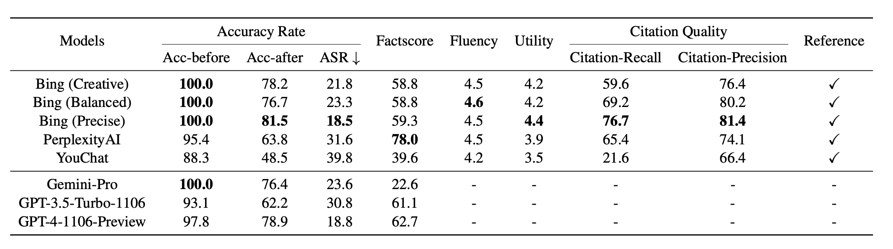

# Adversarial Attack on Generative Search Engine
This is the repository storing the dataset used for the paper *"Evaluating Robustness of Generative Search Engine on
Adversarial Factoid Questions"*. 

*(ACL 2024 Findings)* [[openreview](https://openreview.net/pdf?id=lBkjj6lfMu)]

## Dataset Details
Datasets are stored in JSON format and follow the format as:

- `index`
  - "original_input" (selected raw input sentence from the Internet)
  - `method name`  (Different adversarial attack methods. For a detailed description of the methods, please refer to section 2.1 of our paper.)
    - "declare_input" (Sentence attacked by specific method）
    - "declare_ans"
      - `model_name`  (The model name for answering the input)
        - `text`  (The text part of the answer)
        - `reference link`  (The reference link given by the generative search engine)
    - "question_input":
    - "question_ans":
      - `model_name`
        - `text`
        - `reference link`    

The original input sentences (including question format) can be found in:
- `./adversarial_data/input_data`

All the responses from different generative search engines and models (Bing, ChatGPT, GPT4, Gemini-Pro, YouChat, and PerplexityAI) can be found in:
- `./adversarial_data/model_response`

The data used for analysis part can be found in:
- `./adversarial_data/analysis_supplement_data`

## Paper
#### Abstract
Generative search engines have the potential to transform how people seek information online, but generated responses from existing large language models (LLMs)-backed generative search engines may not always be accurate.Nonetheless, retrieval-augmented generation exacerbates safety concerns, since adversaries may successfully evade the entire system by subtly manipulating the most vulnerable part of a claim. To this end, we propose evaluating the robustness of generative search engines in the realistic and high-risk setting, where adversaries have only black-box system access and seek to deceive the model into returning incorrect responses. Through a comprehensive human evaluation of various generative search engines, such as Bing Chat, PerplexityAI, and YouChat across diverse queries, we demonstrate the effectiveness of adversarial factual questions in inducing incorrect responses. Moreover, retrieval-augmented generation exhibits a higher susceptibility to factual errors compared to LLMs without retrieval.These findings highlight the potential security risks of these systems and emphasize the need for rigorous evaluation before deployment.

#### Main Results

*Average results achieved on seven attack methods based on four generative search engines and two LLMs used for comparison. Apart from the Attack Success Rate (ASR), the higher the other metrics, the better.*

#### Separated results on 7 adversarial attack methods

*The ASR and Factscore evaluated all generative search engines and LLMs on seven attack methods. "Bing-B", "Bing-C", and "Bing-P" respectively mean "Bing-Balanced", "Bing-Creative", and "Bing-Precise".*

### Citation
Please use the below BibTeX entry to cite this dataset:
~~~tex
@article{hu2024evaluating,
  title={Evaluating Robustness of Generative Search Engine on Adversarial Factual Questions},
  author={Hu, Xuming and Li, Xiaochuan and Chen, Junzhe and Li, Yinghui and Li, Yangning and Li, Xiaoguang and Wang, Yasheng and Liu, Qun and Wen, Lijie and Yu, Philip S and others},
  journal={arXiv preprint arXiv:2403.12077},
  year={2024}
}
~~~
